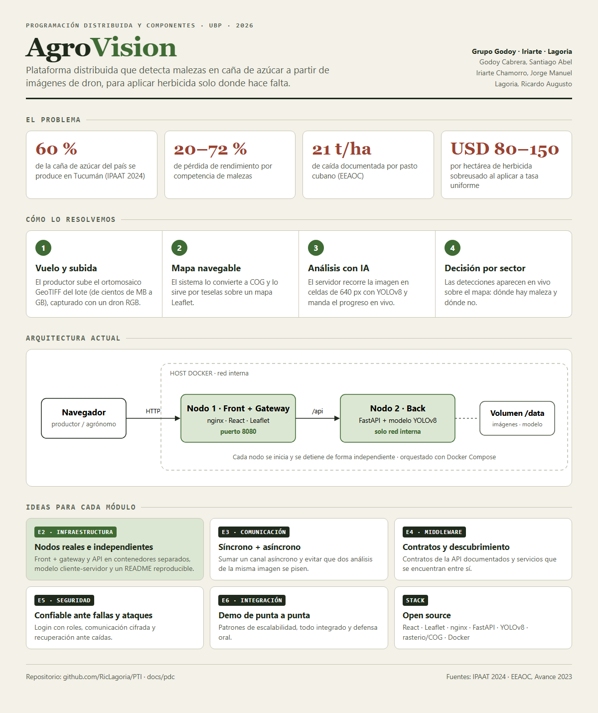
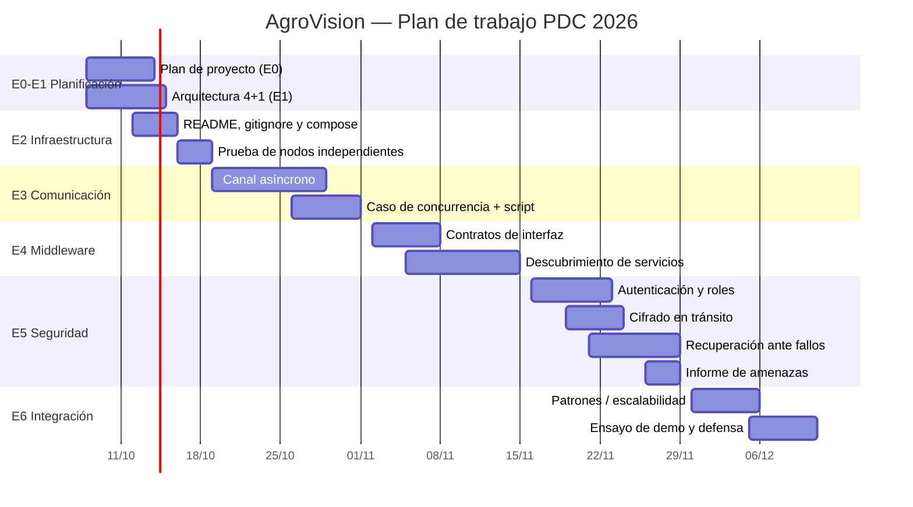

# Certificación de Entrega — Entrega 0: Plan de proyecto

**Programación Distribuida y Componentes — Proyecto Final**

> Introducción — Definición del proyecto: el objetivo de esta entrega es definir la idea general del
> proyecto considerando los módulos que luego deberán ser cumplidos y certificados.

## Datos generales

| Campo | Valor |
|---|---|
| **Grupo N°** | _Completar_ (Godoy – Iriarte – Lagoria) |
| **Tag / Release de esta entrega** | `v0-plan` |
| **Fecha de entrega** | 07/09/2026 |

## Proyecto

| Campo | Valor |
|---|---|
| **Área** | Agrotecnología — Agricultura de precisión |
| **Empresa o entidad asociada** | Proyecto académico de la Universidad Blas Pascal. Toma como referencia técnica y agronómica los trabajos del INTA EEA Famaillá y de la EEAOC (Tucumán), que son la fuente de los datos del problema. |
| **Título** | **AgroVision** — Plataforma distribuida de detección de malezas en caña de azúcar a partir de imágenes de dron |
| **Dominio** | Repositorio: <https://github.com/RicLagoria/PTI> — documentación de PDC en `docs/pdc/` |

**Breve descripción.** AgroVision es una plataforma web en la que un productor o agrónomo sube el
ortomosaico georreferenciado (GeoTIFF) de un lote de caña de azúcar tomado con un dron RGB; el
sistema lo publica como mapa navegable y lo recorre en celdas con un modelo de visión artificial
(YOLOv8) para marcar sobre el mapa dónde hay malezas y otros elementos del campo. Con eso el
productor puede aplicar herbicida solo donde hace falta en lugar de hacerlo a tasa uniforme sobre
todo el lote. El proyecto reutiliza el MVP construido en Proyecto Tecnológico Integrador y lo
transforma, módulo a módulo, en un sistema distribuido: nodos separados, comunicación síncrona y
asíncrona, contratos de interfaz con descubrimiento de servicios, seguridad y tolerancia a fallos.

## Infografía

## Descripción

**Problema.** Tucumán concentra cerca del 60 % de la producción nacional de caña de azúcar (zafra
2024: 17 millones de toneladas sobre 294.470 ha, según el IPAAT). Las malezas son el principal
factor biótico que limita el rendimiento: la literatura reporta pérdidas del 20 % al 72 % y la EEAOC
documentó caídas de hasta 21,44 t/ha por competencia con pasto cubano. Hoy el control se hace
aplicando herbicida a tasa uniforme sobre todo el lote, con un sobreuso estimado de USD 80–150/ha
por campaña y un impacto ambiental sobre la cuenca del Río Salí.

**Solución.** Un sistema que, a partir de las imágenes de dron, indique **dónde** hay maleza y dónde
no, para que el productor decida la aplicación por sector. El flujo de uso es:

1. El usuario sube el ortomosaico (GeoTIFF de cientos de MB a varios GB).
2. El sistema lo valida, lo convierte a COG (Cloud Optimized GeoTIFF) y lo sirve como mapa por
   teselas.
3. El usuario lanza un análisis (imagen completa o un cuadrante, con umbral de confianza).
4. El análisis recorre la imagen en celdas de 640 px, ejecuta el modelo YOLOv8 y devuelve las
   detecciones con su posición geográfica, que se van dibujando sobre el mapa en tiempo real.

**Por qué es un problema distribuido.** El análisis de un ortomosaico es pesado (minutos de CPU),
los archivos son grandes y varios usuarios pueden trabajar a la vez, incluso sobre el mismo lote.
Eso obliga a separar la interfaz, la API y el procesamiento en nodos distintos, a comunicar trabajos
largos de forma asíncrona, a resolver accesos concurrentes a los mismos resultados y a poder escalar
y recuperar los nodos de inferencia de forma independiente.

**Punto de partida.** El MVP de PTI ya funciona con dos contenedores (frontend React + nginx y
backend FastAPI + YOLOv8) orquestados con Docker Compose. Cada entrega de PDC agrega una capa:

| Módulo | Entrega | Qué se agrega sobre el MVP |
|---|---|---|
| 1 — Introducción | E1 | Propuesta de arquitectura con el modelo 4+1 |
| 2 — Infraestructura | E2 | Nodos separados e independientes, modelo de ejecución justificado, README reproducible |
| 3 — Comunicación | E3 | Un canal síncrono y uno asíncrono entre componentes; resolver dos análisis simultáneos sobre la misma imagen |
| 4 — Middleware | E4 | Contratos de interfaz documentados y algún mecanismo de descubrimiento de servicios |
| 5 — Seguridad | E5 | Autenticación y roles, comunicación cifrada, recuperación ante fallos, informe de amenazas |
| 6 — Integración | E6 | Patrones y escalabilidad, demo en vivo y defensa |

**Alcance.** Queda fuera del proyecto de PDC todo lo que es agronómico o de IA y no aporta a lo
distribuido: entrenamiento de nuevas clases de maleza, fotogrametría con OpenDroneMap, índices
satelitales y motor de reglas de prescripción. Esos temas siguen dentro de PTI.

## Planificación

Fechas tentativas, a ajustar al calendario de la cátedra.

| Etapa | Período aproximado | Hito |
|---|---|---|
| E0 + E1 — Planificación y arquitectura | 08/10 – 14/10 | Plan y propuesta 4+1 aprobados |
| E2 — Infraestructura | 12/10 – 18/10 | Dos nodos levantando de forma independiente con un README reproducible |
| E3 — Comunicación | 19/10 – 01/11 | Canal síncrono y asíncrono funcionando; caso de concurrencia demostrado |
| E4 — Middleware | 02/11 – 15/11 | Contratos documentados y servicios que se descubren entre sí |
| E5 — Seguridad | 16/11 – 29/11 | Login con roles, comunicación cifrada y recuperación ante una caída |
| E6 — Integración | 30/11 – 11/12 | Demo de punta a punta y defensa oral |

## Actividades

| Épica | Sprint | Historias / tareas principales |
|---|---|---|
| **EP0 — Definición** | **S0 "Semilla"** | Plan de proyecto, infografía, propuesta de arquitectura 4+1, diagramas |
| **EP1 — Infraestructura** | **S1 "Cimientos"** | Corregir README y `.gitignore`, ordenar el `docker-compose`, verificar el arranque y la detención independiente de cada nodo, justificar el modelo de ejecución |
| **EP2 — Comunicación** | **S2 "Mensajero"** | Definir e implementar el canal asíncrono; resolver el caso de dos análisis simultáneos sobre la misma imagen y un script que lo demuestre |
| **EP3 — Middleware** | **S3 "Contrato"** | Documentar los contratos de la API (por ejemplo con el Swagger que ya genera FastAPI), elegir e implementar un mecanismo de descubrimiento de servicios |
| **EP4 — Seguridad y confiabilidad** | **S4 "Escudo"** | Login real con roles (productor / agrónomo / admin), HTTPS, un mecanismo de recuperación ante fallos, informe de amenazas |
| **EP5 — Integración** | **S5 "Cosecha"** | Patrones de escalabilidad, resolver devoluciones pendientes, guion y ensayo de demo, defensa |

## Participación

| Integrante | Rol principal | Tareas |
|---|---|---|
| **Godoy Cabrera, Santiago Abel** | Frontend, documentación e integración | Adaptación del front React (estado de trabajos, progreso vía API, login), documentación e infografías de cada entrega, pruebas de punta a punta y guion de la demo |
| **Iriarte Chamorro, Jorge Manuel** | Infraestructura / DevOps | Docker Compose y nodos, comunicación asíncrona, recuperación ante fallos, cifrado |
| **Lagoria, Ricardo Augusto** | Backend / API | API FastAPI, contratos de interfaz, descubrimiento de servicios, resolución del caso de concurrencia, autenticación y autorización |

**Forma de trabajo.** Cada cambio sale en una rama desde `master` que también existe en el remoto,
se prueba, pasa por PR a `testing`, se prueba integrado con el resto y luego pasa por PR a
`master`. Cada entrega queda marcada con un tag (`v0-plan`, `v1-arquitectura`, …). Todos revisan los
PR de los demás, para que cualquiera pueda explicar cualquier parte en la defensa.

---

### Espacio para el docente

| Nota | Corregido por | Fecha de corrección |
|---|---|---|
| ____ / 10 | | __ /__ / ____ |

**Observaciones:**
