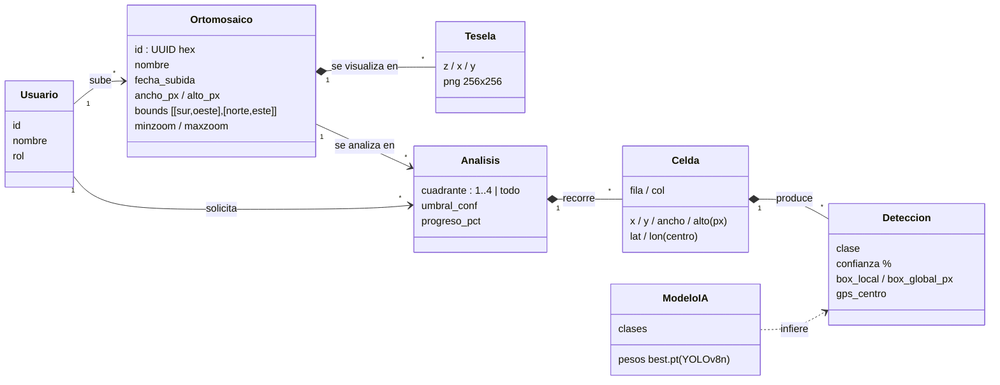
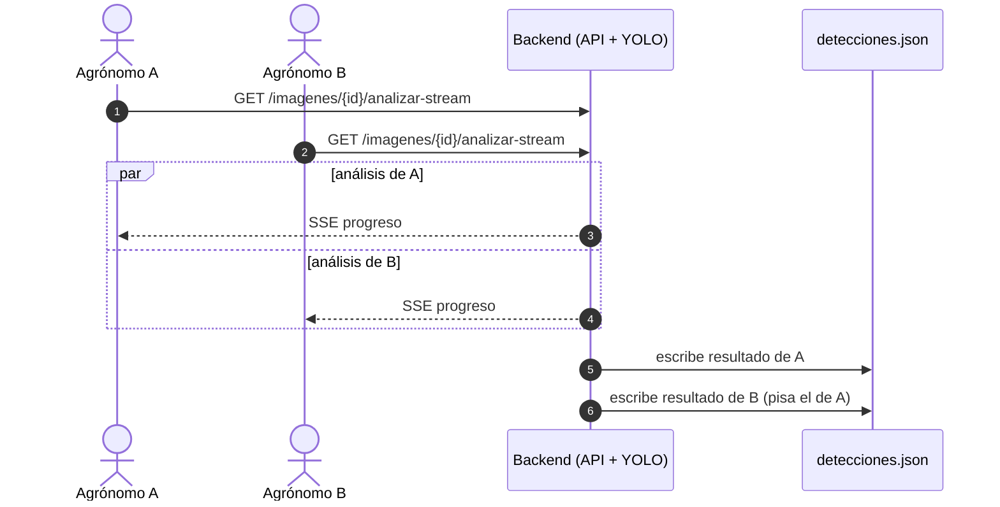
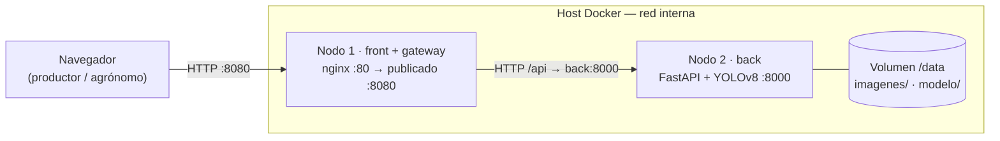

# Entrega 1 — Propuesta de arquitectura (modelo 4+1)

**AgroVision — Plataforma distribuida de detección de malezas en caña de azúcar**
Programación Distribuida y Componentes · Grupo Godoy – Iriarte – Lagoria · Tag `v1-arquitectura`

> Cada vista describe el sistema **tal como existe hoy**, en el MVP heredado de PTI
> (`project/mvp/`). Al final de cada una se anotan **ideas a evaluar** para las próximas entregas.
> Son líneas de trabajo posibles, no decisiones tomadas: la tecnología concreta se elige en cada
> módulo.


---

## 1. Problema a resolver

**Qué hace el sistema.** Recibe el ortomosaico georreferenciado (GeoTIFF) de un lote de caña de
azúcar, capturado con un dron RGB. Lo publica como mapa navegable y lo analiza con un modelo de
visión artificial (YOLOv8) para marcar sobre el mapa dónde hay malezas y otros elementos del campo.

**Para quién.**

- **Productor cañero**: ve qué sectores de su lote tienen maleza para aplicar herbicida solo ahí.
- **Agrónomo o asesor técnico**: analiza los lotes de varios clientes, ajusta el umbral de
  confianza y compara análisis.
- **Administrador de la plataforma**: gestiona usuarios y recursos.

**Por qué importa.** En Tucumán, que concentra cerca del 60 % de la caña del país, las malezas
causan pérdidas del 20 % al 72 % del rendimiento. Hoy el herbicida se aplica a tasa uniforme, con
un sobreuso estimado de USD 80–150/ha por campaña (IPAAT 2024; EEAOC, Avance 2023).

## 2. Justificación de la temática y correlato en el mercado laboral

- **Es un problema real y local.** El grupo ya lo relevó en Proyecto Tecnológico Integrador, con
  datos del INTA EEA Famaillá y de la EEAOC, y tiene un MVP funcionando. PDC no arranca de cero: se
  concentra en la parte distribuida del sistema.
- **Necesita distribución de verdad, no por decorado.** Los archivos pesan de cientos de MB a
  varios GB, cada análisis consume minutos de CPU y varios usuarios pueden analizar a la vez,
  incluso el mismo lote. Eso plantea problemas reales de comunicación, concurrencia, escalabilidad
  y tolerancia a fallos.
- **Tiene correlato directo en la industria.** La agricultura digital es un sector activo en
  Argentina y en el mundo:
  - Plataformas de mapeo y análisis con drones: DroneDeploy, Pix4Dfields.
  - Detección de malezas y pulverización selectiva: John Deere See & Spray, Taranis.
  - Agtech argentinas que ofrecen análisis de lotes como servicio web: Auravant, Kilimo.

  Todas combinan un visor de mapas, una API y procesamiento geoespacial e IA del lado del
  servidor. Los perfiles que piden (backend distribuido, DevOps, MLOps, desarrollo geoespacial) son
  los que ejercita este proyecto.

## 3. Vista lógica

Entidades principales del dominio y su relación:



| Entidad | Dónde está hoy |
|---|---|
| Ortomosaico (metadatos) | `almacen.py` → `meta.json` por imagen |
| Tesela | `server.py` (`rio-tiler`, endpoint `/tiles/{z}/{x}/{y}.png`) |
| Análisis | Implícito: dura lo que dura el request SSE de `server.py` |
| Celda | `geo.py` → `GeoHandler.obtener_lista_cuadrantes` |
| Detección | `detector.py` → `FieldDetector.procesar_lote_celdas` |
| ModeloIA | `detector.py` (YOLOv8n, pesos en el volumen `/data/modelo`) |
| Usuario | Solo un login de prueba en el front, sin backend |

**Ideas a evaluar:** que el análisis pase a ser una entidad propia con estado (pendiente, en curso,
terminado, fallido), para poder consultarlo sin depender de una conexión abierta; y que los
usuarios y roles existan de verdad en el servidor.

## 4. Vista de desarrollo

Organización actual del código. Cada servicio tiene su propio `Dockerfile` y se comunica con el
otro solo por HTTP, nunca importando código del otro.

```
project/mvp/
├── front-react/              # SPA React + Vite + HeroUI + Leaflet, servida por nginx
│   ├── src/components/       #   Home, Dashboard, FieldView (mapa), Settings, Login
│   ├── src/services/         #   ImagenesService.ts: único punto que habla con la API
│   └── nginx.conf            #   gateway: sirve la SPA y hace de proxy de /api → back
├── back/                     # servicio backend (FastAPI)
│   ├── server.py             #   endpoints REST, teselas y SSE
│   ├── almacen.py            #   persistencia de ortomosaicos en el volumen /data
│   ├── predict.py            #   orquesta el análisis por bloques de celdas
│   ├── geo.py                #   lectura del raster por ventanas
│   └── detector.py           #   inferencia YOLOv8
├── docker-compose.yml        # orquestación local de los dos servicios
└── data/                     # volumen compartido (no versionado): imagenes/, modelo/best.pt
docs/pdc/entrega-N/           # documentación de cada entrega
```

| Capa | Módulo | Responsabilidad |
|---|---|---|
| Presentación | `front-react` | Mapa, subida de archivos, lanzar análisis y mostrar el progreso |
| Gateway | `nginx` (en el contenedor del front) | Único punto de entrada; *reverse proxy* de `/api` |
| API | `back/server.py`, `almacen.py` | Contrato REST, almacenamiento y teselas |
| Procesamiento | `back/predict.py`, `geo.py`, `detector.py` | Recorrido de la imagen en celdas e inferencia YOLO |

**Ideas a evaluar:** la capa de procesamiento ya está aislada en sus propios módulos, así que
podría separarse de la API en un servicio aparte si las próximas entregas lo necesitan.

## 5. Vista de procesos

Puntos de concurrencia y sincronización identificados en el sistema actual:

| # | Punto | Qué pasa hoy |
|---|---|---|
| **P1** | **Dos análisis simultáneos sobre el mismo ortomosaico** | Cada request corre su propio análisis y los dos escriben `detecciones.json` en la misma carpeta. Gana el último que termina y se pierde, o se mezcla, el resultado del otro. Además se duplica el consumo de CPU. |
| P2 | Análisis largo dentro del proceso de la API | Ocupa un hilo del servidor durante minutos. Si el cliente se desconecta, el análisis se corta. |
| P3 | Muchas teselas concurrentes al mover el mapa | Lecturas en paralelo sobre el mismo archivo COG. Son solo lecturas, así que no generan conflictos. |
| P4 | Subida y conversión a COG | Cada subida escribe en una carpeta con un UUID propio, así que no hay colisiones. La conversión es síncrona dentro del request. |

Secuencia actual del caso P1 (dos usuarios analizan la misma imagen):



**Ideas a evaluar:**

- Para P1: permitir un solo análisis activo por imagen (algún tipo de lock) y escribir el
  resultado de forma atómica.
- Para P2: desacoplar el pedido del procesamiento con comunicación asíncrona, para que el análisis
  no dependa de que el cliente siga conectado.

## 6. Vista física

Hoy el sistema corre en **un host con Docker y dos nodos** (contenedores), más un volumen
compartido:



| Nodo | Relación con los demás |
|---|---|
| Front + gateway (nginx) | Único nodo expuesto al exterior. Hace de proxy de `/api` hacia el back. |
| Back (FastAPI + YOLOv8) | Solo accesible por la red interna. Lee y escribe en `/data`. |

**Ideas a evaluar:** sumar nodos a medida que lo pidan las entregas, por ejemplo un intermediario
de mensajes para la comunicación asíncrona o varias réplicas del procesamiento para escalar y
tolerar caídas.

## 7. Escenarios (+1)

### CU-01 — Analizar un lote

> *Un productor sube el ortomosaico de su lote y quiere ver dónde hay maleza.*

1. Sube `lote-norte.tif` (2 GB).
2. Ve el campo en el mapa.
3. Lanza el análisis del cuadrante NE con un umbral del 25 %.
4. Mira cómo aparecen las detecciones sobre el mapa a medida que avanza.

| Vista | Cómo la atraviesa el escenario |
|---|---|
| **Lógica** | Se crea un `Ortomosaico`, se generan `Teselas` para el visor, se lanza un `Analisis` (cuadrante 2, conf 0.25) que recorre `Celdas` y produce `Detecciones` con el `ModeloIA`. |
| **Desarrollo** | `FieldView.tsx` llama a `ImagenesService.subirImagen` → `server.py` (`POST /imagenes`) → `almacen.finalizar_subida` (COG). El análisis lo lanza `server.py` y lo ejecutan `predict.py` → `geo.py` + `detector.py`. |
| **Procesos** | La subida es *streaming* y no bloquea a otros usuarios. Las teselas se sirven en paralelo. El análisis ocupa un hilo del servidor y va mandando el progreso por SSE. |
| **Física** | Navegador → nginx (Nodo 1) → back (Nodo 2) → volumen `/data`. |

### CU-02 — Análisis concurrente del mismo lote

> *Dos agrónomos del mismo establecimiento abren el lote y presionan "Analizar" con segundos de
> diferencia.*

Hoy los dos análisis corren completos y el último en terminar pisa el resultado del otro en
`detecciones.json` (punto P1 de la vista de procesos). Es el caso de concurrencia candidato para
resolver y demostrar en la Entrega 3.

---

### Referencias

- IPAAT (2024). *Reporte final de zafra 2024*.
- EEAOC / Revista Avance (2023). *Relevamiento de malezas en caña de azúcar en Tucumán*.
- Kruchten, P. (1995). *Architectural Blueprints — The "4+1" View Model of Software Architecture*. IEEE Software 12(6).
- Documentación del MVP de PTI: `CLAUDE.md` y `project/mvp/` de este repositorio.
