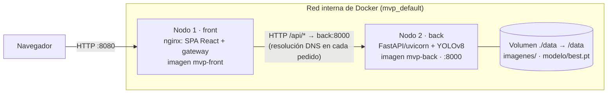
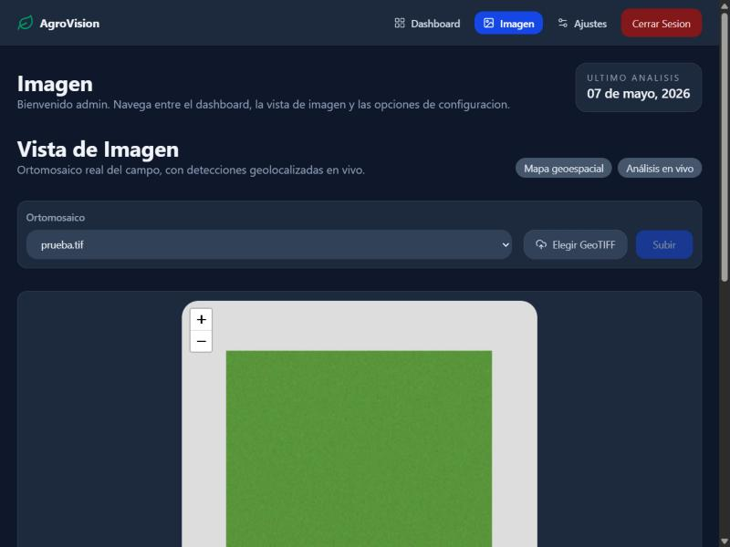

# Entrega 2 — Infraestructura

**AgroVision — Plataforma distribuida de detección de malezas en caña de azúcar**
Programación Distribuida y Componentes · Grupo Godoy – Iriarte – Lagoria · Tag `v2-infraestructura`

## 1. Qué se entrega

Un esqueleto real con **dos nodos separados**, cada uno en su propio contenedor, con su propia
imagen y su propio proceso. Se comunican solo por la red interna de Docker:



| Nodo | Imagen / build | Proceso | Puerto | Responsabilidad |
|---|---|---|---|---|
| `front` | `front-react/Dockerfile` (node:20 → nginx:alpine, multi-stage) | nginx | `8080` publicado al host | Sirve la SPA (React + Leaflet) y hace de *gateway*: reenvía `/api/*` a la API |
| `back` | `back/Dockerfile` (python:3.9-slim + torch CPU) | uvicorn (FastAPI) | `8000`, solo red interna | Carga y validación de GeoTIFF y conversión a COG, teselas XYZ, análisis YOLOv8 con progreso por SSE |

La API **no se publica al host**: el único punto de entrada es el gateway.

## 2. La separación es real

No es una maqueta: el front no tiene datos fijos para el mapa. Todo lo que muestra lo pide a la API
por HTTP. Se verificó de punta a punta a través del gateway:

| Prueba | Resultado |
|---|---|
| `GET /api/imagenes` | `200 []` |
| `POST /api/imagenes?nombre=prueba.tif`: subida de un GeoTIFF de 1300×1300 px georreferenciado en Tucumán | `201` con `id`, `bounds` y zoom. El archivo queda como COG en el volumen. |
| `GET /api/imagenes/{id}/tiles/19/167188/302681.png` | `200 image/png` (77 KB) |
| `GET /api/imagenes/{id}/analizar-stream?conf=0.05` | 9 eventos SSE con progreso del 11 % al 100 % |
| Interfaz en `http://localhost:8080/campo` | Muestra la imagen subida en el mapa, servida por teselas |



### Cada nodo se inicia y se detiene de forma independiente

Script reproducible: [`probar-nodos.sh`](probar-nodos.sh). Salida obtenida
([`salida-prueba.txt`](salida-prueba.txt)):

```
== 1) Detengo SOLO la API: el front sigue sirviendo, /api devuelve 502
back: exited
front: running
front /             -> 200
front /api/imagenes -> 502
== 2) Levanto la API sin tocar el front
front /api/imagenes -> 200 (la API volvió)
== 3) Detengo SOLO el front: la API sigue viva en la red interna
back: running
front: exited
desde afuera :8080 -> 000 (sin respuesta)
API por dentro      -> 200
== 4) Levanto el front de nuevo
front /            -> 200
front /api/imagenes -> 200
```

### Problema encontrado y corregido durante la prueba

En la primera corrida apareció un acoplamiento oculto. nginx resolvía el nombre `back` **una sola
vez, al arrancar**, y se quedaba con esa IP. Consecuencias:

- Con la API detenida, cada pedido a `/api` quedaba colgado **60 segundos** hasta dar `504`.
- Si la API se recreaba (`docker compose rm` + `up`) y tomaba otra IP, el gateway seguía apuntando
  a la vieja. Había que reiniciar también el front, así que los nodos no eran independientes de
  verdad.

**Corrección** en `project/mvp/front-react/nginx.conf`:

- `resolver 127.0.0.11 valid=10s`: usa el DNS interno de Docker.
- `proxy_pass` a una variable: obliga a resolver el nombre en cada pedido.
- `proxy_connect_timeout 5s`: falla rápido.

Resultado medido:

- Con la API caída, el gateway responde `502` en ~4 s en vez de colgarse 60 s.
- Con la API recreada con otra IP, el gateway la encuentra sola en ~5 s, sin reiniciarse.

## 3. Modelo de ejecución elegido: cliente-servidor en capas

El sistema sigue un modelo **cliente-servidor** de tres capas: cliente liviano en el navegador,
gateway y servidor de aplicación (API + modelo de IA en el mismo nodo).

| Alternativa | ¿Sirve para este caso de uso? |
|---|---|
| **Cliente-servidor (elegido)** | **Sí.** Los ortomosaicos pesan de cientos de MB a varios GB y el análisis YOLO consume minutos de CPU. Eso no puede vivir en el navegador ni en el celular del productor. El servidor centraliza los datos y el cómputo, y el cliente solo visualiza teselas livianas (PNG de 256 px) y recibe resultados. Además da un único punto de control para el acceso a los datos. |
| P2P | **No.** No hay pares simétricos que compartan recursos: los productores no se intercambian imágenes ni cómputo entre sí. Los datos tienen un dueño y un lugar canónico. P2P complicaría la consistencia de los resultados y el control de acceso sin aportar nada. |
| Microservicios | **No por ahora.** El backend es un único servicio con una sola responsabilidad: recibir imágenes, servirlas y analizarlas. Partirlo hoy en varios servicios agregaría comunicación entre ellos sin una necesidad concreta del caso de uso. |

## 4. Cómo levantar el entorno localmente

Está en el [README principal del repositorio](../../../README.md#inicio-rápido), sección
"Inicio rápido". En resumen:

```bash
git clone https://github.com/RicLagoria/PTI.git
cd PTI/project/mvp
mkdir -p data/modelo && cp train-3/weights/best.pt data/modelo/best.pt
docker compose up -d --build
# http://localhost:8080   (usuario de prueba admin / 1234)
```

## 5. Cambios hechos al repositorio en esta entrega

| Archivo | Cambio | Por qué |
|---|---|---|
| `README.md` | "Inicio rápido" reescrito con los pasos reales | El anterior hablaba de `infra/docker-compose.yml`, `.env` y puertos 3000/8000, que no existen. No mencionaba copiar los pesos del modelo. |
| `.gitignore` | Resuelto un conflicto de merge que había quedado commiteado (`<<<<<<< HEAD`) y actualizadas las rutas a `project/mvp/...` | Tras mover el código a `project/`, la carpeta `data/` (imágenes de GB y pesos) dejó de estar ignorada y podía terminar en un commit |
| `project/mvp/front-react/nginx.conf` | Resolución DNS dinámica y timeout corto hacia la API | Independencia real entre nodos (ver §2) |
| `docs/pdc/entrega-2-infraestructura/` | Este informe, el script de prueba, su salida y las capturas | Evidencia |

## 6. Observaciones del estado actual

- El análisis corre dentro del proceso de la API y ocupa un hilo durante minutos. Dos análisis
  simultáneos de la misma imagen escriben el mismo `detecciones.json`.
- Swagger responde en `/api/docs`, pero la página busca `/openapi.json` en la raíz y el gateway
  le devuelve la SPA. El JSON sí está disponible en `/api/openapi.json`.
- El login del front es un mock en el navegador (`admin`/`1234`), CORS está abierto a `*` y no hay
  health checks. `depends_on` solo ordena el arranque y no espera a que la API esté lista (tarda
  ~15 s en cargar torch).
